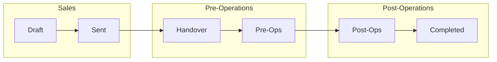

# Outbound Travelers — TMS Workflow Guide

*A conceptual, plain-language overview of how the Travel Management System (TMS) works — the people, the lifecycle of a booking, each module, and the rules behind them. Share this with team members, new staff, or developers to get the full picture without reading code.*

---

## 1. What this system is

The TMS is the internal operating system for an outbound travel agency. It runs the **entire life of a trip** — from the first quote a salesperson builds, through confirmation and payment, the operations handover, on-tour management, and final closure — with **Finance** tracking the money the whole way.

Everyone logs into **one app**, but each person sees only **their lane** (their role's screens and their own bookings).

The central object in the system is the **Itinerary (a "booking")**. Almost everything — payments, checklists, DMC details, documents, status — hangs off a booking.

---

## 2. Who uses it (roles)

| Role | What they do | Sees |
|---|---|---|
| **Sales** | Build quotes/itineraries, send to clients, collect advance, hand over to Operations | Their own bookings |
| **Sales Lead** | Everything Sales does + oversee their team | Their team's bookings |
| **Pre-Ops** (Operations) | Receive handed-over bookings, verify everything, complete the pre-trip SOP checklist, hand to Post-Ops | Bookings assigned to them |
| **Pre-Ops Lead** | Pre-Ops + team oversight | Their team's bookings |
| **Post-Ops** | Manage the client while travelling, collect balance, handle on-trip issues, close out | Bookings in the post-ops stage (team-shared) |
| **Post-Ops Lead** | Post-Ops + team oversight | Team's post-ops bookings |
| **Finance / Finance Lead** | Payments, invoices, the finance register & reports | Finance screens |
| **Admin / Owner** | Full visibility and control across every role, plus user management, SOP templates, destinations, settings | Everything |

> **Revenue & margin figures are Admin/Owner-only by policy** — they are never shown to other roles.

---

## 3. The big picture — a booking's lifecycle

Every booking moves through these stages in order:

```
DRAFT ──► SENT ──► (CONFIRMED) ──► HANDOVER ──► PRE-OPS ──► POST-OPS ──► COMPLETED
  └── Sales ──────────────┘        └──── Pre-Operations ────┘   └─ Post-Operations ─┘
```



- **Draft / Sent** — the booking is still owned by **Sales**.
- **Handover / Pre-Ops** — handed to **Pre-Operations** for verification and document prep.
- **Post-Ops / Completed** — handed to **Post-Operations** for on-trip management and closure.

The current stage controls **who can act**, **what buttons appear**, and **which pipeline column** the booking sits in.

---

## 4. Stage-by-stage workflow

### 4.1 Sales — create → send → handover

1. **Build the itinerary.** The salesperson uses the Itinerary Generator (custom, ready-made package, or manual) to assemble destinations, day-by-day plan, hotels, transfers, flights, activities, and **pricing plans** (e.g. *Deluxe*, *Super Deluxe*). Each plan has a total price.
2. **Send to client.** "Mark as Sent" moves the booking from **Draft → Sent** and records who/when.
3. **Pre-handover checklist.** Before handing over, Sales completes a **Sales Pre-Handover Checklist** (auto-built from the admin's "File Handover" SOP). It captures things like DMC name/contact/quote/cost, flight & passport documents, payment status, and a final acknowledgement. Uploading a file or answering a field auto-ticks the item.
4. **Collect advance & hand over.** When ready, "Collect Advance & Move to Handover" opens the **payment modal** (advance/balance/full), records the payment, and moves the booking to **Handover**.

### 4.2 Pre-Operations — receive → verify → process → hand to Post-Ops

1. **Auto-assignment (round-robin).** The moment a booking reaches **Handover**, the system **auto-assigns a Pre-Ops handler** using a *least-loaded* round-robin among active Pre-Ops staff. The assignee gets a **notification** (a persistent on-screen alert) until they open and acknowledge it.
2. **Acknowledge the handover.** The Pre-Ops handler reviews the **Sales Handover Data** (everything Sales filled in) and clicks **Acknowledge** — this unlocks the Pre-Ops checklist.
3. **Pre-Ops SOP checklist.** They work through the **Pre-Ops SOP checklist** (admin-defined order) — e.g. Verified Details, Invoice Sent, DMC Booking, Hotel/Service Vouchers, Passenger Form, Travel-readiness call, Balance Payment, DMC Voucher Received, and a final confirmation. Items can require text, a file upload, a choice, or an acknowledgement.
4. **Hand to Post-Ops.** Once all mandatory items are done, **"Handover to Post-Ops"** moves the booking to **Post-Ops** (and initialises the post-ops checklist).

### 4.3 Post-Operations — on-tour stages → balance → closure

Post-Ops is **team-shared** (no per-person assignment). The booking's **sub-stage is derived from the trip dates**:

```
PRE-ARRIVAL ──► ON-TOUR ──► TRIP-ENDING ──► FEEDBACK & CLOSURE (Completed)
 (before start)  (during)   (last day)       (after end / manual)
```

1. **Pre-arrival** — trip hasn't started; final prep & client communication.
2. **On-tour** — client is travelling; daily monitoring, issue handling, balance payment collection.
3. **Trip-ending** — last day logistics (departure, arrival cards).
4. **Feedback & Closure** — after the trip; mark **Completed**.

### 4.4 Finance — runs alongside the whole flow

Finance isn't a stage; it operates in parallel:
- **Payments** — advance/balance/full, with screenshot proof. The booking's **amount paid** is kept correct automatically.
- **Invoices** — generated per booking.
- **Finance Register & Reports** — revenue, margin, GST, TCS, DMC cost, aging, forecasts (Admin/Owner-only figures).

---

## 5. Key cross-cutting features

### Access Tokens (edit-after-handover)
Once a booking leaves Sales (Handover and beyond), it's **locked** for Sales. If Sales needs to change something, they **raise an access-token request** with a reason. **Pre-Ops/Post-Ops approve or reject** it. On a decision, Sales gets a **dialog notification** (approved → editing unlocks for 24h; rejected → message). Pending requests show a **count badge** on the approver's "Pending Tokens" menu.

### Upsell / Downsell
Any handler (Sales, Pre-Ops, Post-Ops, Admin) can record an **Upsell** (client paid more) or **Downsell** (paid less) on a booking. They pick the **previous plan**, enter the **amount**, and the system computes the **new total** (previous ± amount). A coloured **Upsell/Downsell badge** then appears on the booking across every role's view, and a **banner** on the itinerary — so everyone knows the price changed. The new total becomes the booking's authoritative sell price.

### DMC Management
**DMC** = Destination Management Company (the on-ground supplier). DMC details (name, contact, quote, cost) are captured during Sales handover. The **DMC Management** screen shows them **scoped by role**:
- Admin → all DMCs, grouped by vendor, with booking counts and who booked them.
- Sales → their own; Sales Lead → their team's.
- Pre-Ops / Post-Ops → DMCs for their bookings, **including which salesperson booked it**.

### Checklists (SOP-driven)
Admins define **SOP templates** (per department) with ordered items and categories. When a booking needs a checklist, the system **builds it from the matching SOP** and shows items **in the admin-defined order**. Each item supports text, number, date, file upload, multiple-choice, or acknowledgement.

### Notifications
- **Pre-Ops assignment alert** — when a booking is handed to you, a persistent notification shows until you open & acknowledge it.
- **Pending-token badge** — count of approvals waiting on you.
- **Token decision dialog** — Sales is told the moment a request is approved/rejected.

### Aura AI assistant
An in-app AI helper (the ✨ widget) that answers SOP-grounded questions, drafts itineraries from real inventory, compares against competitor quotes, and composes client messages. It only ever sees the **role-appropriate** slice of data (e.g. finance figures are stripped for non-admins).

---

## 6. Roles & permissions (at a glance)

| Capability | Sales | Sales Lead | Pre-Ops | Post-Ops | Finance | Admin |
|---|:--:|:--:|:--:|:--:|:--:|:--:|
| Create / edit own itineraries | ✅ | ✅ (team) | — | — | — | ✅ (all) |
| Handover to Pre-Ops | ✅ | ✅ | — | — | — | ✅ |
| Pre-Ops checklist & handover to Post-Ops | — | — | ✅ | — | — | ✅ |
| Post-Ops on-tour management & closure | — | — | — | ✅ | — | ✅ |
| Approve access tokens | — | — | ✅ | ✅ | — | ✅ |
| Record upsell / downsell | ✅ | ✅ | ✅ | ✅ | — | ✅ |
| See revenue / margin | — | — | — | — | — | ✅ |
| Manage users, SOPs, destinations, settings | — | — | — | — | — | ✅ |

---

## 7. Login & accounts

- Sign-in is **email + password**.
- **Admins create users** and **set/reset their passwords** from the **Users** screen; each user can change their own password after logging in.
- Sessions are token-based (stay logged in ~7 days). Logging out requires signing in again.
- Each person is restricted to their role's screens; visibility of bookings follows ownership (your bookings / your team / your assignments).

---

## 8. Data model (conceptual)

- **Itinerary (booking)** = the core record: customer, destination, dates, pax, pricing plans, selected plan, status, who created it, who it's assigned to, amount paid, and stage.
- **Attached to each booking:** day-by-day plan, hotels, transfers, flights, activities, pricing, **payments**, and **checklists** (sales / pre-ops / post-ops).
- **Supporting records:** Users, Destinations (with a pricing master of hotels/rates), Packages (ready-made templates), Customers, SOP templates, Access Tokens, Settings.

Think of it as: **one booking → many attached lists**, with the booking's **status** driving the workflow and the **role** driving who sees and acts on it.

---

## 9. Money model (conceptual)

- **Sell price** = the selected plan's total (or the revised total after an upsell/downsell).
- **GST** = 5%, **inclusive** in the price.
- **TCS** = 2% on international bookings (a pass-through tax, not income).
- **Revenue** = cost (excl. GST) − DMC cost − agent fees. **Margin %** is measured against cost.
- **Amount paid** = sum of all recorded payments, kept accurate automatically.

*(Revenue and margin are visible to Admin/Owner only.)*

---

## 10. Technology (one-paragraph version)

The app is a **Next.js** web application running on **Cloudflare Workers**. Data lives in **Cloudflare D1** (a SQL database); uploaded files (payment screenshots, vouchers, documents) live in **Cloudflare R2** (object storage). It's reached through a normal web browser — no installation. Access to data is controlled by the login session, with public, read-only links available for sharing a finished itinerary with clients.

---

## 11. Glossary

- **TMS** — Travel Management System (this app).
- **Itinerary / Booking** — a single client trip and everything attached to it.
- **SOP** — Standard Operating Procedure; the admin-defined checklist template a stage runs on.
- **Handover** — passing a booking from one team to the next (Sales→Pre-Ops, Pre-Ops→Post-Ops).
- **DMC** — Destination Management Company (on-ground supplier).
- **Access Token** — temporary permission for Sales to edit a booking after it's been handed over.
- **Upsell / Downsell** — a recorded increase/decrease to a booking's price after the original quote.
- **Pipeline / Kanban** — the board view showing bookings grouped by stage.
- **Round-robin** — the fair, least-loaded way Pre-Ops handlers are auto-assigned.

---

*End of guide. For the deep technical/architecture notes, see `CLAUDE.md` and `OUTBOUND_TMS_KNOWLEDGE.md` in the repository.*
