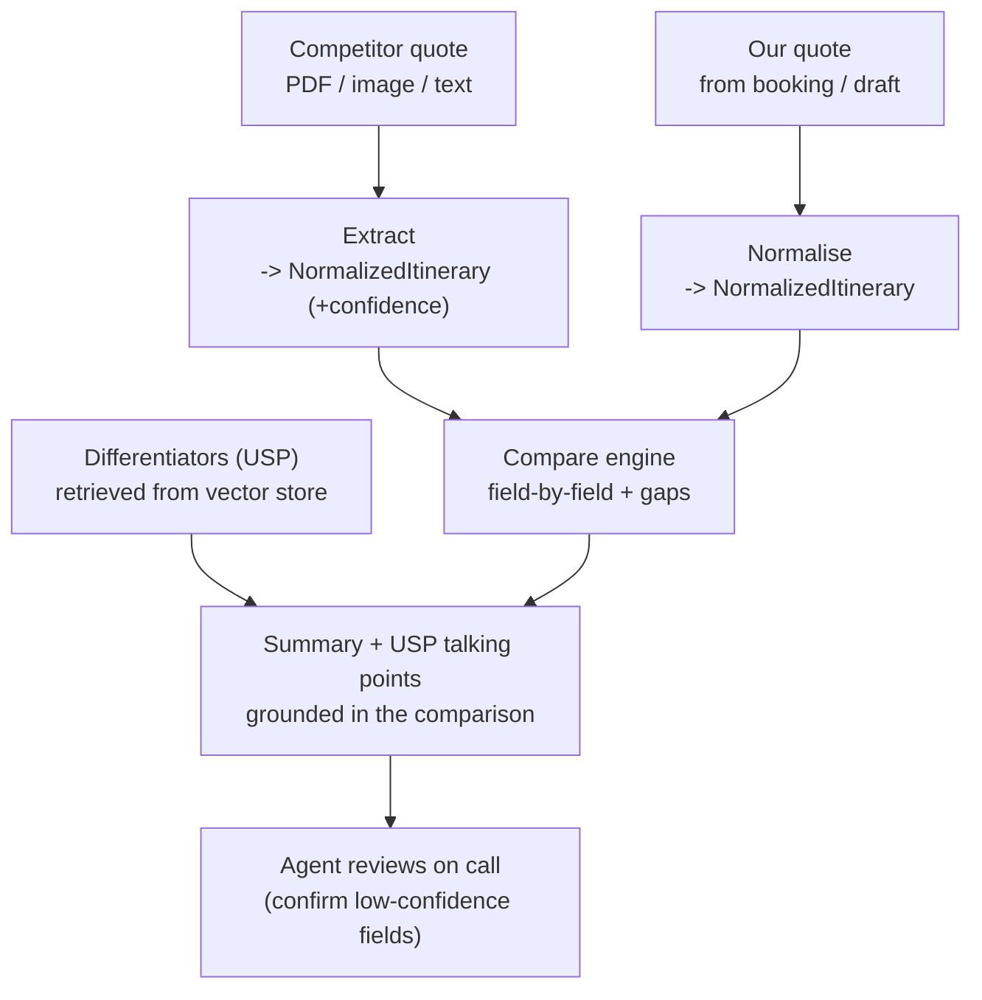

# Aura AI — Quote Comparison (Compete Mode) · Build Doc

> **For the dev team / Claude Code.** Self-contained feature spec. Build milestone by milestone (Section 9); each has acceptance criteria. Schemas (Section 7) and the model prompt (Section 8) are authoritative — match them and ask before deviating.

---

## 1. Goal

A prospect forwards a **competitor's itinerary/quote** ("X gave me this cheaper"). The sales agent uploads or pastes it, and Aura returns: (a) an **apple-to-apple comparison** of ours vs theirs, (b) a **differentiated summary** explaining the real differences — especially *why* theirs is cheaper, and (c) **honest, evidence-based talking points** drawn from our genuine strengths to win the deal. The agent reviews and uses it on the call; Aura never sends anything to the client.

## 2. Reality check (read before building)

- **Extraction is the hard part and the quality ceiling.** Clean PDFs / pasted text parse well; photos & screenshots need OCR / a vision-capable model and are less reliable. **Build extraction first (M1)**, attach a `confidence` score, and have the agent confirm low-confidence fields. Do not pretend a fuzzy photo was parsed perfectly.
- **Compare on inclusions/exclusions, not headline price.** A cheaper quote is usually cheaper because it excludes or downgrades something (meal plan, hotel category, transfers, taxes, transport). Surfacing *that* is the feature's value.
- **Honesty is a hard requirement.** Talking points must be grounded in the actual parsed differences and our real differentiators — never invented competitor flaws, never guarantees/false promises (this enforces our SOP's false-promise rule).

## 3. Context — Aura's modes

| Mode | Job | Behaviour |
|---|---|---|
| Guidance (separate spec) | Answer SOP questions | Strict RAG, read-only |
| Draft (separate spec) | Generate tentative itineraries | Generative, grounded in inventory |
| **Compare** (this doc) | Compare our quote vs a competitor's | Extract → normalise → compare → honest USPs, human-in-the-loop |

This doc covers **Compare mode only**. It reuses the `inventory` data from Draft mode and adds a new `differentiators` (USP) knowledge collection.

## 4. Scope

**In scope:** a `compare_quote` endpoint; competitor-document ingestion (PDF / image / pasted text); normalisation of both itineraries to one schema; a field-by-field comparison engine; a differentiators KB; honest USP talking-point generation; front-end (upload + comparison view).

**Out of scope:** sending anything to the client (agent-only output); re-quoting or changing our price; legally/financially binding statements; any fabricated competitor claim; storing competitor pricing as our own data.

## 5. Stack & assumptions

- **Model:** self-hosted open-weight model (Ollama/vLLM). For image inputs, a **vision-capable model or a separate OCR step** (e.g. Tesseract) to produce text first.
- **Vector store:** reuse pgvector/Qdrant. New collection: `differentiators`.
- **Our itinerary source:** pulled from the existing booking/quote record (by `bookingId`) or a `DraftItinerary` object.
- **Backend/front-end:** existing service + Vercel front-end (TypeScript assumed; adjust if different).

## 6. Architecture / flow



Aura never invents: comparison rows come from the two normalised itineraries; USP points are tied to specific comparison findings + the differentiators KB.

## 7. Data contracts

### 7.1 Request

```ts
interface CompareRequest {
  mode: "compare_quote";
  competitor_input: {
    kind: "pdf" | "image" | "text";
    file_ref?: string;   // storage ref for pdf/image
    text?: string;       // when kind === "text"
  };
  our_side: { booking_id?: string; itinerary?: NormalizedItinerary };
  agent_id: string;
}
```

### 7.2 NormalizedItinerary (the comparability backbone — both sides map to this)

```ts
interface NormalizedItinerary {
  source: "ours" | "competitor";
  destination: string;
  nights: number;
  stays: Array<{
    nights: number;
    hotel_name?: string;
    category?: string;       // "3-star" | "4-star" | "Deluxe" ...
    room_type?: string;
    meal_plan?: "EP" | "CP" | "MAP" | "AP" | string;
  }>;
  transport?: { type?: "private" | "shared" | string; vehicle?: string };
  transfers_included?: boolean;     // e.g. airport pickup/drop
  sightseeing?: string[];
  inclusions?: string[];
  exclusions?: string[];
  taxes_included?: boolean | "unclear";
  price?: { amount?: number; currency?: string; basis?: "per_person" | "total" | "per_couple" };
  confidence: number;               // 0..1 — extraction confidence (competitor side)
  extraction_warnings?: string[];   // e.g. "meal plan not stated", "price basis unclear"
}
```

### 7.3 Differentiator (USP knowledge collection)

```ts
interface Differentiator {
  id: string;
  claim: string;            // our genuine strength, e.g. "Airport transfers always included"
  evidence_field: string;   // which NormalizedItinerary field it maps to, e.g. "transfers_included"
  text: string;             // embedded for retrieval
}
```

### 7.4 Response

```ts
interface ComparisonRow {
  field: string;            // "Hotel category", "Meal plan", "Airport transfer", "Taxes", "Transport"
  ours: string;
  theirs: string;
  delta: "ours_better" | "theirs_better" | "same" | "unclear";
  note?: string;
}

interface CompareResponse {
  rows: ComparisonRow[];
  gaps: string[];                  // what theirs excludes/downgrades vs ours (and vice versa, honestly)
  price_gap_explanation: string;   // why theirs is cheaper, in terms of the gaps above
  differentiated_summary: string;  // plain narrative the agent can read out
  usp_talking_points: Array<{ point: string; based_on: string }>; // each tied to a row/gap or differentiator
  confirm_with_client: string[];   // questions to verify the competitor's hidden costs
  confidence: number;              // overall extraction confidence
  extraction_warnings: string[];
}
```

## 8. Compete-mode system prompt

```text
You are Aura in COMPARE mode, helping a sales agent respond when a prospect
shares a competitor's cheaper itinerary. You produce an honest, apple-to-apple
comparison and evidence-based talking points.

You are given two NormalizedItineraries (OURS and COMPETITOR) and a set of our
DIFFERENTIATORS.

RULES:
- Compare like-for-like: align by nights, hotel category, meal plan, transfers,
  sightseeing, transport, and taxes — not just total price.
- Explain WHY the competitor is cheaper in terms of concrete exclusions or
  downgrades you can see in their itinerary (e.g. CP vs MAP, 3-star vs 4-star,
  no airport transfer, taxes extra, shared vs private transport).
- Be honest. If the competitor genuinely includes something we don't, say so.
  Never invent a flaw, price, or detail that is not in the COMPETITOR data.
- Every talking point must be tied to a specific comparison row/gap or a
  DIFFERENTIATOR. No generic marketing claims.
- Make NO promises or guarantees (upgrades, weather, views, "best price").
- Where the competitor itinerary is unclear or low-confidence, do not assume —
  list it under confirm_with_client as a question for the agent to ask.
- Return ONLY valid JSON matching CompareResponse. No prose outside the JSON.

OURS:
{our NormalizedItinerary}

COMPETITOR:
{competitor NormalizedItinerary, including confidence + extraction_warnings}

DIFFERENTIATORS:
{retrieved Differentiator items}
```

## 9. Implementation plan (milestones)

### M0 — Endpoint skeleton & input handling
- [ ] `POST /aura/compare-quote`; accept `pdf` / `image` / `text` competitor input + `our_side`.
- [ ] Store/queue uploaded files; return a stubbed `CompareResponse`.
- **Done when:** endpoint accepts all three input kinds and returns a schema-valid stub.

### M1 — Competitor extraction (the risky one — do early)
- [ ] PDF/text → text. Image → OCR / vision model → text.
- [ ] LLM extraction: text → `NormalizedItinerary` with `confidence` + `extraction_warnings`.
- [ ] Never fail silently: missing fields become warnings, not guesses.
- **Done when:** sample PDFs and one photo each yield a `NormalizedItinerary`; ambiguous fields appear as warnings; confidence reflects input quality.

### M2 — Normalise our side
- [ ] Map our booking/quote (or a `DraftItinerary`) to `NormalizedItinerary` (`source: "ours"`, confidence 1).
- **Done when:** our quote maps cleanly to the same schema.

### M3 — Comparison engine
- [ ] Field-by-field rows (category, meal plan, transfers, taxes, transport, nights, sightseeing).
- [ ] Gap detection (both directions) and a `price_gap_explanation` derived from the gaps.
- **Done when:** for a known pair, rows + gaps + price explanation are correct.

### M4 — Differentiators KB + USP generation
- [ ] Ingest our real USPs as `Differentiator`s into the `differentiators` collection.
- [ ] Retrieve relevant differentiators; generate `usp_talking_points`, each with a `based_on` reference.
- **Done when:** every talking point is traceable to a row/gap or a differentiator.

### M5 — Guardrails & validation
- [ ] Validate output against `CompareResponse`.
- [ ] Enforce Section 10 rules (no invented competitor facts, no promises, low-confidence → confirm list). Reject/repair on violation.
- **Done when:** all guardrail tests (Section 11) pass.

### M6 — Front-end + tests
- [ ] Upload/paste UI on the quote screen; render the comparison table, summary, talking points, and confirm-list; show confidence + warnings prominently.
- [ ] Unit tests + a small eval set (Section 11); manual QA.
- **Done when:** agent can upload a competitor quote → see comparison + talking points → use on call.

## 10. Business rules / guardrails (testable)

1. **No invented competitor data.** Every value in `theirs` traces to extracted competitor text. Unknown → "not stated", never fabricated.
2. **Honest both ways.** If the competitor includes something we don't, it appears in `gaps` and the summary.
3. **Talking points are grounded.** Each `usp_talking_points[].based_on` references a real row/gap or a differentiator id.
4. **No promises.** Reject guarantee/false-promise language.
5. **Confidence-aware.** If overall `confidence` is low or a field is `unclear`, push it to `confirm_with_client` instead of asserting it.
6. **Price framing.** `price_gap_explanation` must reference concrete inclusions/exclusions, not just "we're worth it".
7. **Human-in-the-loop.** Output goes to the agent only; nothing is sent to the client; our price is never changed.

## 11. Test cases

| Input | Assert |
|---|---|
| Competitor PDF: CP meal plan, ours MAP | Row "Meal plan" `ours_better`; gap + price explanation mention meals |
| Competitor: 3-star, ours 4-star | Row "Hotel category" `ours_better`; reflected in summary |
| Competitor itinerary omits airport transfer | "Airport transfer" row `theirs: not stated`; appears in `confirm_with_client` |
| Competitor states "taxes extra" | "Taxes" `theirs_better`(price) but flagged; explanation notes their price excludes tax |
| Competitor genuinely includes an extra excursion we don't | Honestly listed in `gaps`; no fabricated counter-claim |
| Photo screenshot of a quote | Extraction returns warnings + lower confidence; ambiguous fields → confirm list |
| Garbled OCR | Low confidence; no asserted competitor numbers; agent prompted to re-upload/confirm |
| Model writes "guaranteed cheapest" | Guardrail #4 rejects/repairs |

## 12. Suggested module layout

```
/aura
  /compare
    route.ts            # POST /aura/compare-quote
    ingest.ts           # pdf/image/text -> raw text (OCR/vision)
    extractCompetitor.ts# raw text -> NormalizedItinerary (+confidence)
    normalizeOurs.ts    # booking/draft -> NormalizedItinerary
    compareEngine.ts    # rows + gaps + price_gap_explanation
    differentiators.ts  # retrieve USP items
    buildPrompt.ts      # Section 8
    guardrails.ts       # Section 10
    schema.ts           # zod/types
  /differentiators
    seed.ts             # ingest our real USPs
/frontend
  CompareUpload.tsx
  CompareTable.tsx      # rows + summary + talking points + confirm-list + confidence
```

## 13. Using this doc with Claude Code

- Commit as `docs/aura-compare-quote-BUILD.md`.
- Keep the project **`CLAUDE.md` lean** (target under ~200 lines — longer reduces adherence) and point to this spec: add `See @docs/aura-compare-quote-BUILD.md for the quote-comparison build.` `CLAUDE.md` auto-loads each session and is shared via source control. (Docs: https://docs.anthropic.com/en/docs/claude-code/memory)
- Drive it milestone by milestone. First message: *"Read docs/aura-compare-quote-BUILD.md. In plan mode, propose how you'll implement M1 (competitor extraction), then wait for approval."* — start with M1 because it's the riskiest.
- Schemas (Section 7) and prompt (Section 8) are authoritative; instruct Claude Code to match them and to ask before deviating.

## 14. Related / next

- Companion docs: **Guidance mode** (SOP assistant) and **Draft mode** (itinerary generation).
- Future: a small win/loss log so Aura learns which talking points actually convert.
