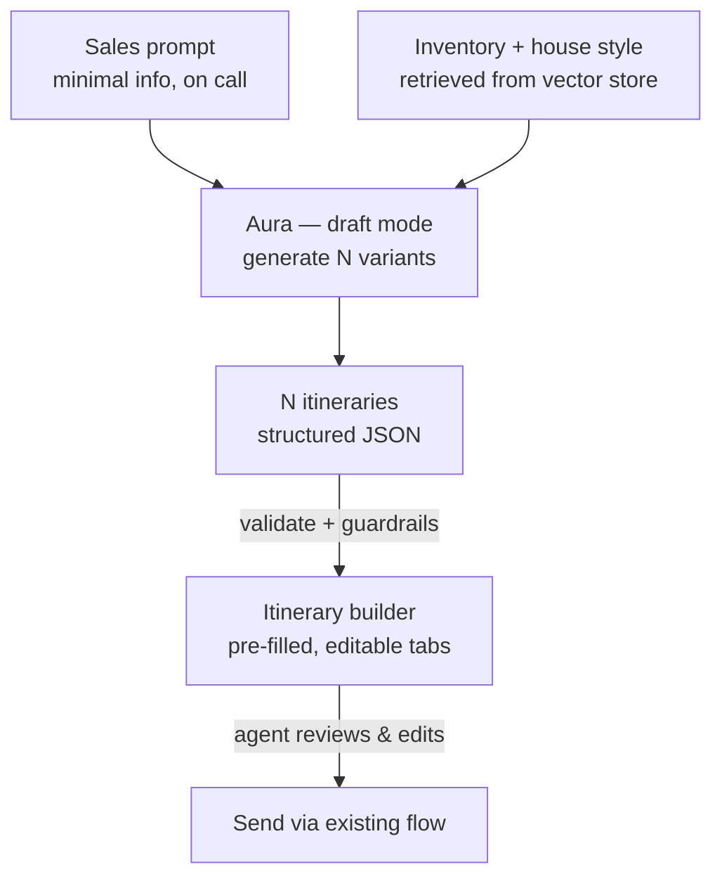

# Aura AI — Itinerary Drafting (Draft Mode) · Build Doc

> **For the dev team / Claude Code.** This is a self-contained feature spec. Implement it milestone by milestone (Section 8). Each milestone has acceptance criteria. Schemas and the model prompt are authoritative — match them exactly.

---

## 1. Goal

When a sales agent is on a call and the prospect asks for "a few tentative itineraries" but **no dates and no destination are locked yet**, the agent should not hand-build three itineraries. Instead they type one short prompt, hit **Draft 3 itineraries**, and Aura returns three on-brand, editable itinerary drafts that pre-fill the existing itinerary builder. Target: ~15 min of manual work → ~1 min.

## 2. Context — Aura has two modes

Aura is a self-hosted, retrieval-grounded assistant. It runs in two distinct modes that **must not share a code path**:

| Mode | Job | Behaviour |
|---|---|---|
| **Guidance** (separate spec) | Answer SOP / process questions | Strict RAG, answers only from the SOP, never generates, read-only |
| **Draft** (this doc) | Generate tentative sample itineraries | Generative, grounded in our *inventory + house style*, human-in-the-loop |

This doc covers **Draft mode only**. It can be built independently of Guidance mode, provided the model server and vector store exist (Section 4).

## 3. Scope

**In scope:** a `draft_itineraries` backend endpoint, an `inventory` knowledge collection, prompt assembly, schema-validated JSON output, business-rule guardrails, and front-end wiring into the existing itinerary builder + Send flow.

**Out of scope:** Guidance mode; auto-sending (Aura never sends — the agent reviews and uses the existing Send Itinerary flow); firm pricing/quoting; booking creation; payment logic.

## 4. Stack & assumptions

- **Model:** self-hosted open-weight model (~7B–30B class) served via **Ollama** or **vLLM**. No external AI calls.
- **Vector store:** Postgres + **pgvector** (or Qdrant). Add a new collection/table: `inventory`.
- **Retrieval:** LangChain or LlamaIndex (reuse whatever Guidance mode uses).
- **Backend:** a service the existing Vercel front-end calls. Assumed TypeScript/Node (adjust if different).
- **Front-end:** existing itinerary builder already supports day-wise plan, hotel/transfer cards, and hashtags — the output schema below mirrors those fields so drafts pre-fill directly.

> If the front-end builder's field names differ from Section 6, **align the output schema to the real builder model** and note the change here.

## 5. Architecture / flow



The model is **only** asked to assemble itineraries from the retrieved inventory in our house style — not to know anything. That is why a small model is sufficient and why output stays on-brand.

## 6. Data contracts

### 6.1 Request (front-end → backend)

```ts
interface DraftItinerariesRequest {
  mode: "draft_itineraries";
  count: number;                 // default 3
  vary_by: "destination" | "style" | "budget"; // default "destination" when no destination given
  known: {
    pax: { adults: number; children: number };
    duration_days?: number;      // optional / approximate
    budget_band?: "budget" | "mid" | "premium";
    month?: string | null;       // null = unknown (fine)
    destination?: string | null; // null = unknown (fine)
    interests?: string[];
  };
  free_text?: string;            // whatever the agent typed
  agent_id: string;              // for attribution / audit
}
```

### 6.2 Inventory record (knowledge collection `inventory`)

Each chunk is a building block Aura may use. **Aura may only use destinations/hotels/DMCs present here.**

```ts
interface InventoryItem {
  type: "destination" | "hotel" | "dmc" | "inclusion" | "seasonality" | "style_note";
  destination?: string;          // e.g. "Kashmir"
  name?: string;                 // e.g. "Hotel Heritage Inn"
  category?: string;             // e.g. "Deluxe"
  meal_plans?: string[];         // e.g. ["CP","MAP"]
  indicative_price_band?: string;// e.g. "₹9,000–11,000 / person" (NEVER a quote)
  best_months?: string[];        // for seasonality guardrail
  text: string;                  // free description, embedded for retrieval
}
```

### 6.3 Output (backend → front-end) — mirrors the existing builder

```ts
interface DraftItinerary {
  label: string;                 // "Option A — Kashmir, relaxed"
  destination: string;
  duration_days: number;
  hashtags: string[];
  indicative_price_band?: string | null; // band from inventory, or null. NEVER a quote.
  tentative: true;               // always true
  days: Array<{
    day: number;                 // 1, 2, 3 ... — NO calendar dates
    title: string;
    plan: string;
    hotel?: { name: string; category: string; meal_plan: string };
    transfers?: string[];
  }>;
}

interface DraftItinerariesResponse {
  itineraries: DraftItinerary[]; // length === request.count
  assumptions: string[];         // human-readable notes for gaps Aura filled
}
```

### 6.4 Example response (one option shown; expect `count` of them)

```json
{
  "itineraries": [
    {
      "label": "Option A — Kashmir, relaxed",
      "destination": "Kashmir",
      "duration_days": 4,
      "hashtags": ["#MountainEscape", "#FamilyFriendly"],
      "indicative_price_band": "₹9,000–11,000 / person",
      "tentative": true,
      "days": [
        {
          "day": 1,
          "title": "Arrival in Srinagar",
          "plan": "Airport pickup, hotel check-in, evening Dal Lake shikara ride.",
          "hotel": { "name": "Hotel Heritage Inn", "category": "Deluxe", "meal_plan": "CP" },
          "transfers": ["Airport → Hotel"]
        }
      ]
    }
  ],
  "assumptions": [
    "No destination given — offered 3 different destinations.",
    "No dates set — used Day 1/2/3 structure; agent to set real dates on confirmation."
  ]
}
```

## 7. The draft-mode system prompt

Fixed prompt. The retrieved inventory and the request fields are appended as context at runtime. Placeholders in `{ }`.

```text
You are Aura in DRAFT mode, creating TENTATIVE sample itineraries for a sales
agent who is live on a call with a prospect.

Produce exactly {count} itineraries that differ by {vary_by}
(destination | style | budget).

RULES:
- Use ONLY destinations, hotels, DMCs and inclusions present in the INVENTORY
  context below. Never invent a place or a hotel we do not sell.
- These are tentative. Do NOT give firm prices. Use the indicative band from
  inventory, or leave price null. Never present a quote.
- No fixed calendar dates. Structure each itinerary as Day 1, Day 2, ...
  (dates are not set yet).
- Make no promises or guarantees of any kind (upgrades, weather, specific views).
- Respect seasonality: do not propose a destination/activity that the INVENTORY
  marks as unsuitable for {month} (when a month is given).
- Match our house style: day-wise plan, hotel + transfer cards, relevant hashtags.
- Record any gap you filled (missing destination, budget, dates) in "assumptions".
- Return ONLY valid JSON matching the OUTPUT schema. No prose outside the JSON.

INVENTORY:
{retrieved inventory items}

REQUEST:
{the DraftItinerariesRequest as compact JSON}
```

Use the model server's JSON / structured-output mode where available; otherwise validate and repair (Milestone 4).

## 8. Implementation plan (milestones)

Work top to bottom. Don't start a milestone until the previous one's acceptance criteria pass.

### M0 — Prereqs & endpoint skeleton
- [ ] Confirm model server (Ollama/vLLM) is reachable from the backend.
- [ ] Confirm vector store is up; create the `inventory` collection/table.
- [ ] Add `POST /aura/draft-itineraries` returning a stubbed `DraftItinerariesResponse`.
- **Done when:** the endpoint returns a valid stub matching the response schema.

### M1 — Inventory knowledge base
- [ ] Ingest destinations, hotels (e.g. Hotel Heritage Inn), DMCs, inclusions, seasonality, and house-style notes as `InventoryItem`s.
- [ ] Embed `text` into the `inventory` collection with the metadata fields.
- [ ] Implement `retrieveInventory(request) -> InventoryItem[]` (top-k by interests/destination/budget).
- **Done when:** a sample request returns relevant, real inventory items only.

### M2 — Request handling, defaults & assumptions
- [ ] Validate incoming requests against `DraftItinerariesRequest`.
- [ ] Fill gaps: default `count=3`; default `vary_by="destination"` when `destination` is null; sensible duration if missing.
- [ ] Collect every assumption into a list for the response.
- **Done when:** a minimal request (`free_text` only) is accepted and produces a sane assumptions list.

### M3 — Prompt assembly & generation
- [ ] Build the prompt from Section 7 (system prompt + retrieved inventory + request JSON).
- [ ] Call the model in JSON/structured mode.
- [ ] Parse the response; on invalid JSON, retry once with a repair instruction.
- **Done when:** a real call returns parseable JSON with `count` itineraries.

### M4 — Output validation & guardrails
- [ ] Validate output against `DraftItinerary` / `DraftItinerariesResponse`.
- [ ] Enforce business rules (Section 9). Reject or repair on violation; never return a violating draft.
- **Done when:** all guardrail unit tests (Section 10) pass.

### M5 — Front-end integration
- [ ] Add a **Draft 3 itineraries** action to the Sales screen (button + minimal-input form mapping to the request).
- [ ] Render each returned itinerary as an editable tab/card, pre-filled into the existing builder model.
- [ ] Surface `assumptions` and the `tentative` flag clearly in the UI.
- [ ] Wire "use this one" into the existing **Send Itinerary** + premium-viewer flow. Aura never auto-sends.
- **Done when:** an agent can prompt → see 3 editable drafts → edit → send through the normal flow.

### M6 — Tests & eval
- [ ] Unit tests for request validation, schema validation, and each guardrail.
- [ ] A small eval set (Section 10) asserting structure + rules across varied prompts.
- [ ] Manual QA of the call-time flow.
- **Done when:** eval set is green and QA scenarios pass.

## 9. Business rules / guardrails (testable)

1. **Real inventory only.** Every `destination` and every `hotel.name` in the output must appear in the retrieved inventory set. Reject otherwise.
2. **No firm prices.** `indicative_price_band` is either an inventory band or `null`. No numeric total or per-person quote anywhere in `plan`/`title` text.
3. **Always tentative.** `tentative === true` on every itinerary; UI labels drafts as tentative.
4. **No calendar dates.** `days[].day` are integers; reject any ISO date / month-day string in itinerary text.
5. **No promises.** Reject banned guarantee language (e.g. "guaranteed", "promise", "definitely will", "best view assured").
6. **Seasonality respected.** If `month` is given, don't propose destinations the inventory marks unsuitable for it.
7. **Human-in-the-loop.** No endpoint or flow sends an itinerary to a client. Sending only ever happens through the existing manual flow.
8. **Count match.** `itineraries.length === request.count`.

## 10. Test cases

| Prompt / input | Assert |
|---|---|
| `free_text: "short mountain trip, family, mid budget"`, no destination, no dates | 3 itineraries, 3 *different* destinations, Day 1/2/3 only, `tentative:true`, assumptions note the gaps |
| `destination: "Kashmir"`, `vary_by: "style"` | 3 Kashmir itineraries differing in style; only real Kashmir hotels |
| `vary_by: "budget"`, `budget_band` absent | 3 budget tiers; bands sourced from inventory or null |
| Model returns a hotel not in inventory | Guardrail #1 rejects/repairs; bad draft never returned |
| Model writes "guaranteed lake-view upgrade" | Guardrail #5 rejects/repairs |
| `month: "January"` for a destination marked summer-only | Guardrail #6 excludes it |
| Model returns invalid JSON | M3 repair retry; if still invalid, return a typed error, not garbage |

## 11. Suggested module layout

```
/aura
  /draft
    route.ts            # POST /aura/draft-itineraries
    request.ts          # DraftItinerariesRequest + validation + defaults
    retrieveInventory.ts
    buildPrompt.ts      # Section 7
    generate.ts         # model call + JSON parse/repair
    guardrails.ts       # Section 9 checks
    schema.ts           # zod/types for request + output
  /inventory
    ingest.ts           # one-time + re-index on inventory change
/frontend
  DraftItinerariesButton.tsx
  DraftTabs.tsx         # renders DraftItinerary[] into the existing builder
```

## 12. Using this doc with Claude Code

- Commit this file to the repo (e.g. `docs/aura-itinerary-draft-BUILD.md`) so the whole team — and Claude Code — share one source of truth.
- Keep the project **`CLAUDE.md` lean** (target under ~200 lines; longer files reduce instruction adherence) for conventions only, and point Claude Code at this spec when working the feature — e.g. add a line to `CLAUDE.md`: `See @docs/aura-itinerary-draft-BUILD.md for the itinerary draft-mode build.` `CLAUDE.md` auto-loads at session start and is shared via source control. (Docs: https://docs.anthropic.com/en/docs/claude-code/memory)
- Drive it **milestone by milestone** (Section 8). A good first message to Claude Code: *"Read docs/aura-itinerary-draft-BUILD.md. In plan mode, propose how you'll implement Milestone M0, then wait for approval."*
- The schemas (Section 6) and prompt (Section 7) are authoritative — instruct Claude Code to match them and to ask before deviating.

## 13. Related / next

- **Guidance-mode build doc** (strict RAG SOP assistant) — companion spec, can be a separate `CLAUDE.md`-referenced doc.
- **Proactive nudges** (SLA badges, stuck-booking flags) — later phase, reuses booking context.
