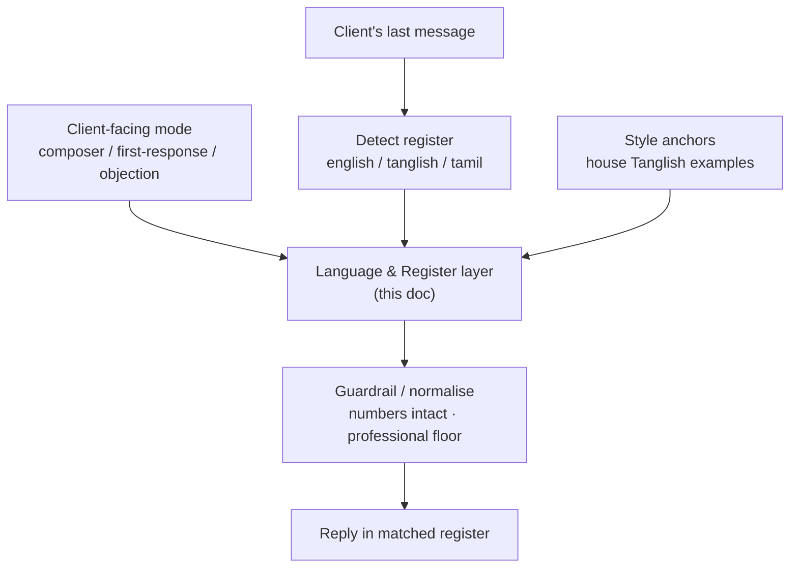

# Aura AI — Language & Register Layer (Tanglish) · Build Doc

> **For the dev team / Claude Code.** This is a **cross-cutting layer**, not a standalone mode. It plugs into the client-facing generators (message composer, first-response, objection handler, upsell talking points). Build milestone by milestone (Section 11). Guardrails (Section 9) are mandatory — especially "numbers stay intact". Ask before deviating.

---

## 1. Goal

Aura should reply to clients in the **same register they use** — including **Tanglish** (casual Tamil–English mix in Latin script) — so messages feel like a warm local travel agent, not a stiff corporate bot. This applies only to client-facing text; internal agent outputs stay in clear English.

## 2. Reality check (read before building)

- **Spike first.** Before building, test the chosen self-hosted model's *raw* Tanglish on ~10 real client messages. Tanglish is informal, code-mixed, and non-standardised — small models vary. If raw output is weak, plan for stronger few-shot anchoring, a model with better Indian-language coverage, or a light fine-tune on real messages.
- **Few-shot anchors are the key asset.** Quality comes mostly from a small bank of real, on-brand Tanglish examples injected into the prompt (Section 10). Build this early.
- **Human eval is required.** A Tamil-speaking team member must review a sample of outputs for naturalness and appropriateness before launch. Automated eval cannot judge Tanglish naturalness.
- **Numbers/dates/codes are sacred.** Prices, amounts, dates, times, booking codes, flight numbers must appear *exactly* as given. This is a hard, regex-checked guardrail (Section 9 #1).

## 3. Context — where this layer sits

Aura's modes (Guidance / Draft / Compare) each have their own spec. This layer is **shared** and called by the client-facing ones:



The mode produces the *content*; this layer controls the *language and tone* of the final client message.

## 4. Scope

**In scope:** register detection on incoming client messages; a `language` option on client-facing generation; a Tanglish style-bank; a reusable prompt fragment; a post-generation guardrail; per-client language preference.

**Out of scope:** internal agent-facing text (SOP guidance, comparison tables stay English); voice/audio; machine translation of documents; anything that alters prices, dates, or policy.

## 5. Stack & assumptions

- **Model:** the existing self-hosted model — *but validate Tanglish quality (Section 2)*. A model with strong Indian-language coverage may be needed.
- **Optional two-step:** generate content in English, then **transcreate** to Tanglish (not literal translation) as a second pass. Decide after the spike; single-pass with anchors is simpler if quality holds.
- **Style-bank:** stored as `StyleAnchor` records (reuse the vector store, new collection `style_anchors`, or a simple table — retrieval by scenario).
- **Preference store:** a `ClientLanguagePref` per client.
- **Tamil script** is supported as an option for clients who prefer it; default Tanglish is Latin script.

## 6. Architecture / flow

See the mermaid in Section 3. Sequence per client-facing request:
1. Resolve target register: explicit `ClientLanguagePref` → else `LanguageOptions.target` → else `auto` (mirror the client's last message).
2. If `auto`, run register detection on `client_message`.
3. Retrieve relevant `StyleAnchor`s for the scenario.
4. Inject the language fragment (Section 8) + anchors into the mode's generation prompt.
5. Post-process & guardrail (Section 9); on failure, fall back to English.

## 7. Data contracts

### 7.1 Language options (added to client-facing requests)

```ts
interface LanguageOptions {
  target: "auto" | "english" | "tanglish" | "tamil"; // default "auto"
  client_message?: string;   // client's last message, used for "auto" mirroring
  client_id?: string;        // to look up a stored preference
}
```

### 7.2 Register detection

```ts
interface RegisterDetection {
  language: "english" | "tanglish" | "tamil" | "other";
  romanized: boolean;          // Latin script vs Tamil script
  formality: "formal" | "casual";
  confidence: number;          // 0..1 — low => fall back to English
}
```

### 7.3 Style anchor (the house Tanglish example bank)

```ts
interface StyleAnchor {
  id: string;
  scenario: string;            // "itinerary_followup" | "advance_nudge" | "objection_price" ...
  english_intent: string;      // what the message should convey
  tanglish_example: string;    // the on-brand Tanglish rendering (seed: Section 10)
}
```

### 7.4 Client language preference

```ts
interface ClientLanguagePref {
  client_id: string;
  preferred: "auto" | "english" | "tanglish" | "tamil";
}
```

## 8. Language & register prompt fragment (injected into client-facing prompts)

```text
LANGUAGE & REGISTER:
- Target: {target}.  If "auto", detect the register of CLIENT_MESSAGE and reply
  in the SAME register (English, Tanglish, or Tamil). If unsure, reply in English.
- Tanglish = casual Tamil-English mix in Latin script: warm, respectful, like a
  helpful local travel agent. Not crude slang, not stiff corporate language.
- Keep ALL prices, amounts (₹), dates, times, booking codes, flight numbers and
  counts EXACTLY as given, in digits/standard form. NEVER translate or
  transliterate a number, date, amount, or code.
- Stay professional: no offensive slang, no over-familiarity. Use one consistent
  spelling style within a message.
- Make no promises or guarantees of any kind.
- If a fact is critical (price, payment deadline, booking code), keep it crystal
  clear; when in doubt, also state the key number/date plainly.

STYLE ANCHORS (match this tone):
{retrieved StyleAnchor examples}

CLIENT_MESSAGE (for register mirroring):
{client's last message}
```

## 9. Business rules / guardrails (testable)

1. **Numbers/dates/codes intact.** Every ₹ amount, date, time, booking code, and flight number present in the source data must appear unchanged in the output. Regex-diff the output against the known values; reject/repair on mismatch. *(Hard rule.)*
2. **Mirror the register.** In `auto`, reply in the client's detected register. If the client writes formal English, reply English even if Tanglish is available.
3. **Preference wins.** A stored `ClientLanguagePref` overrides `auto`.
4. **Professional floor.** Reject offensive/crude slang and over-familiar phrasing, even in casual Tanglish.
5. **Consistent spelling.** One romanisation style per message (no mixing "panneenga"/"pannunga" in the same text).
6. **No promises.** No guarantees/false promises, in any language (enforces the SOP rule).
7. **Confidence fallback.** If register confidence is low, or the model's output looks broken/garbled, fall back to clear English.
8. **Internal stays English.** This layer is never applied to staff-facing outputs.

## 10. Seed style anchors (house Tanglish — extend with real messages)

| scenario | tanglish_example |
|---|---|
| `itinerary_followup` | "Hi Sir, neenga sonna Kashmir trip ku 3 options ready pannirukken. Onnu paathutu sollunga edhu pidikuthunu — date confirm aana udane booking start panlam." |
| `advance_nudge` | "Sir, booking confirm panna ₹3,000 advance podunga. Balance ₹6,775 trip start aagradhuku 7 naal munnadi katti vittaa pothum." |
| `objection_price` | "Sir andha quote la breakfast mattum than (CP). Namma package la breakfast + dinner rendum included (MAP), plus airport pickup free. Adhanaala konja price difference, aana value-ku namma deal nalladhu." |
| `reassurance` | "Kavalai padaadhinga Sir, trip full-a namma team support pannum. Edhuvuna doubt iruntha direct-a call pannunga." |

> Note prices/amounts stay as `₹3,000`, `₹6,775` and counts as `3`, `7` — digits, never transliterated. Collect 20–40 real on-brand messages from your best agents to make this bank strong.

## 11. Implementation plan (milestones)

### M0 — Plumbing + spike
- [ ] Add `LanguageOptions` to client-facing endpoints; default `target: "auto"` behaving as English passthrough until M3.
- [ ] **Spike:** test the model's raw Tanglish on ~10 real messages; record a go/strengthen decision (anchors only vs stronger model vs fine-tune).
- **Done when:** options plumbed through; spike decision documented here.

### M1 — Register detection
- [ ] Implement `detectRegister(client_message) -> RegisterDetection` (LLM or lightweight classifier).
- **Done when:** English / Tanglish / Tamil-script samples are classified with sensible confidence.

### M2 — Style-bank
- [ ] Seed `StyleAnchor`s (Section 10) + real messages; implement `retrieveAnchors(scenario)`.
- **Done when:** relevant anchors return per scenario.

### M3 — Prompt injection + generation
- [ ] Inject the Section 8 fragment + anchors + target register into client-facing generation.
- [ ] Produce Tanglish output for `auto`/`tanglish`.
- **Done when:** a Tanglish client message gets a natural Tanglish reply (human-checked informally).

### M4 — Guardrail / post-process
- [ ] Regex-diff numbers/dates/codes against source data (rule #1); professional-floor check; English fallback on failure.
- **Done when:** all guardrail tests (Section 12) pass; no number/date is ever altered.

### M5 — Per-client preference
- [ ] Store/read `ClientLanguagePref`; preference overrides `auto`.
- **Done when:** a client set to "english" always gets English; "tanglish" always Tanglish.

### M6 — Human eval + rollout
- [ ] Tamil-speaking reviewer rates a sample for naturalness + appropriateness.
- [ ] Unit/eval tests; ship behind a feature flag, monitor, then widen.
- **Done when:** reviewer sign-off + tests green.

## 12. Test cases

| Input | Assert |
|---|---|
| Client writes Tanglish, `target: auto` | Reply in Tanglish, on-brand tone |
| Client writes formal English, `target: auto` | Reply in English (mirror), not Tanglish |
| Output must include `₹9,775`, date `2026-06-15` | Both appear unchanged; rule #1 passes |
| Model transliterates a price (e.g. "onpadhaayiram...") | Rule #1 rejects/repairs |
| Client has `ClientLanguagePref: english` but writes Tanglish | Reply English (preference wins) |
| Crude/over-familiar slang generated | Professional-floor guardrail rejects/repairs |
| Low detection confidence / garbled output | Falls back to clear English |
| Client prefers Tamil script | Reply in Tamil script |

## 13. Suggested module layout

```
/aura
  /lang
    options.ts          # LanguageOptions + resolution (pref > target > auto)
    detectRegister.ts   # RegisterDetection
    anchors.ts          # StyleAnchor retrieval
    fragment.ts         # Section 8 prompt fragment builder
    guardrails.ts       # numbers-intact diff + professional floor + fallback
    schema.ts
  /lang-data
    seedAnchors.ts      # Section 10 + real messages
/store
  clientLanguagePref.ts
```

The client-facing modes (composer, objection, first-response) call `/aura/lang` rather than each implementing language logic.

## 14. Using this doc with Claude Code

- Commit as `docs/aura-language-layer-BUILD.md`.
- Keep the project **`CLAUDE.md` lean** (under ~200 lines — longer reduces adherence); add a pointer: `See @docs/aura-language-layer-BUILD.md for the Tanglish language layer.` `CLAUDE.md` auto-loads each session and is shared via source control. (Docs: https://docs.anthropic.com/en/docs/claude-code/memory)
- Start with **M0's spike** — the model's Tanglish quality decides the whole approach. Good first message: *"Read docs/aura-language-layer-BUILD.md. Implement the M0 spike: generate Tanglish for these 10 sample messages and report quality, then propose whether anchors alone suffice."*
- Schemas (Section 7), the prompt fragment (Section 8), and rule #1 are authoritative — match exactly and ask before deviating.

## 15. Related / next

- The **same layer extends to other code-mixes** (e.g. Hinglish) by adding `StyleAnchor` scenarios and detection labels — no new architecture.
- A per-client **auto-learned tone** (formal vs casual) could be added later from message history.
- Tamil-script and (later) voice messages reuse this layer's register resolution.
